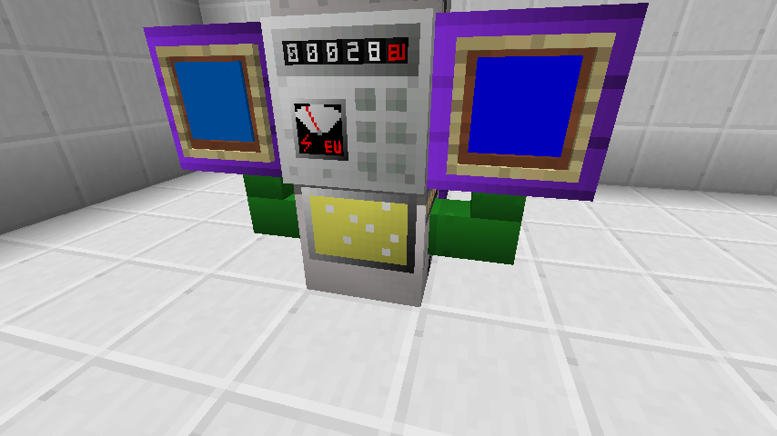

This is an addon for GregTech6 ,mainly made for TerraFirmaRescue-Unofficial, currently in early-stage development.

**Development Mention**

This mod should be used to ADD items,blocks or something, MODIFY and DELETE should be applied to GregTech6-TFRU.

If there are some huge change in something, please consider delete them in GT6-TFRU and re-add them in kTFRUAddon.

Doing this is to keep most part of kTFRUAddon functions properly OUTSIDE TFRU.

**What has MADE or will MADE**

Semiconductor industry line, from monocrystalline silicon , lithography to packaging and running

More cables, pipes

Multi-Tech-Stage, higher efficiency of copper, iron, chromium, tungsten, titanium, aluminum and other mineral processing method

More efficient power generator

MultiBlock Machine in IV or later

**Recently Updates**

What does Flywheel and Water have in common? They can both store energy! Use those flywheel box and large water sink to store your RU!

**Internationalization && Localization**

Unlike GregTech6 itself,kTFRUAddon use internal language files. If you are good at English and another language, feel free to PR!

zh_CN:

这是一个专为群峦救援非官方版制作的mod,目前还处于早期开发中

**开发注意：**

本mod主要用于向GT中“添加”物品、配方、方块等，“修改”与“删除”请至GT6-TFRU进行，如有大幅度改动，建议删除原GT6-TFRU对应代码后迁移至kTFRUAddon中进行修改

**包含/计划包含内容**

半导体工业线，从单晶硅到光刻到封装的全流程

更多线缆、管道

根据科技水平分层、更高产率的铜、铁、铬、钨、钛、铝等矿物处理流水线

更多高效、科学的发电方式

使用IV以上电压的更多强力的大机器

**国际化与本地化**

不像GregTech本身，kTFRUAddon使用mod内置的语言文件进行本地化工作，如果你擅长英语和另一门语言，欢迎提交PR

**最近更新：**

飞轮与淡水有什么共同点?它们都可以存储能量!使用飞轮组和水库存储RU!